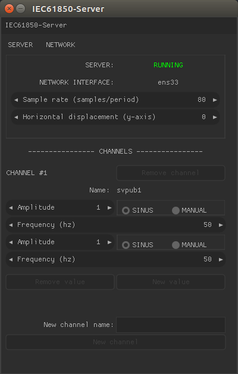
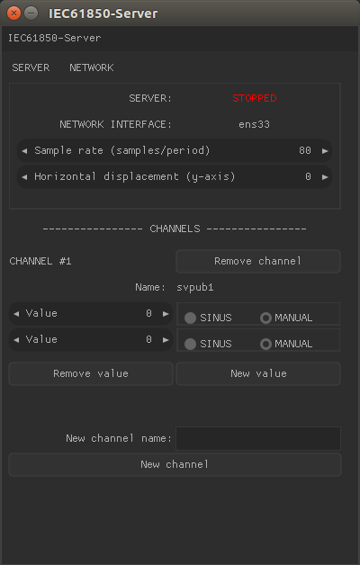

# IEC61850-Server Manual




## How to use
# Scripts
Inside the repository folder there is a folder called 'scripts', inside there are a couple of scripts which will update and launch the applications.

Typical workflow consists of adding a number of channels (by pressing 'New channel') and by adding a number of values to these channels (by pressing 'New value' at the respective channels).

Manual mode on a value results in the value on the left being sent. Sine mode uses a global sine value (which is means it is the same for all the values on all the channels). This is due to design and will probably change in a real-world application.

The sine wave can be configured with three option
- 'Horizontal displacement': Y-axis offset for the RMS line of the wave.
- 'Amplitude': Amplitude of the sine wave (this too is global, despite the fact that it shows one amplitude per value, this too will probably change in a real-world application).
- 'Sample rate': The number of values sampled from the sine wave in on period.
- 'Frequency': The frequency of the sine wave (global as well).

### Adding/removing Channels & Values
The removal and addition of Channels and Values works like a stack. Only the most recent on can be remove and the newest is placed on top.

### Network interface name
In the top menu the button 'NETWORK' presents a pop-up menu with all of the detected network interface names. This setting is important to get right since it directs on which network interface the values will be sent. The program will crash if a illegal interface is selected. The default value of this is 'eth0', for more information see below.

## Building
### Dependencies
- libiec61850 (_included in the source_)
- OpenGL (_should be included in a standard Linux distro_)
- SDL2
- GLEW
- Nuklear (_included in the source_)
- GCC 6.3.0 (_does *not* work on earlier versions (see Problems to address)_)

*Install the dependencies*
```bash  
$ sudo apt-get install libsdl2-dev libglew-dev
```
_if_ the GCC 6.3.0 is missing also install it
```bash  
$ sudo apt-get install g++-6
```
then change in to the directory of the repository and ...
*Run*
```bash  
$ make && sudo ./main <network-interface-name>
```

The first and only command line argument is the network interface name (<network-interface-name>) which is typically something along the lines of 'eth0' on Linux. It defaults to 'eth0'
on all platforms.

The program needs to be run as sudo due to the low-level network access required by libiec61850.

### Performance concerns
Given that the number of samples sent over the network quite easily can move into the thousands per seconds (50 hz * 256 samples/s = 12800 values/s) the performance of the program needs to be investigated. The normal build is unoptimized (add '-O3' to CXXFLAGS variable (line ~15)) in the makefile for optimized builds).

### Portability concerns
All of the components of this program is portable but there is work to be done.
#### Problems to address
- Network interface names are fetched only on Linux
- Nuklear needs a different backend (see Nuklear documentation or their demos)
- Investigate if it is worth using libiec61850 without threads.
- Stopping and starting the server seems to slowly corrupting some memory and
thus will crash after a couple of iterations.
- Our current dependency on GCC 6.3.0 means that on current Long-Term-Support (LTS) releases you need to explicitly change the *CXX* variable in the _makefile_ to *$(CXX)-6* and also install G++-6 (_see above_).

Tested on Ubuntu 17.04.
